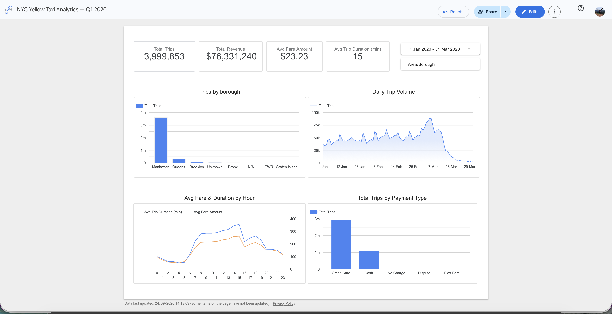

# NYC Yellow Taxi Analytics — dbt + BigQuery + Airflow

An end-to-end analytics engineering project transforming ~4M raw NYC taxi trip records into a tested dimensional model, orchestrated with Airflow and
visualized in a live Looker Studio dashboard.

---

## Dashboard

**[View the live dashboard →](https://datastudio.google.com/s/qbCDMmgaPrM)**



---

## Overview

This project ingests NYC TLC yellow taxi trip data (Q1 2020, ~4M rows) into BigQuery, transforms it through a layered dbt project into a proper star
schema, and serves it through a performance-optimized Looker Studio dashboard. Orchestration is handled by an Airflow DAG that triggers the dbt
Cloud job on a daily schedule.

---

## Architecture

```
Public Dataset (BigQuery) -> raw_taxi.yellow_trips -> dbt (Staging -> Intermediate -> Marts) -> Looker Studio Dashboard
```
*Orchestrated by an Airflow DAG, which triggers the dbt Cloud job (seed → run → test) on a daily schedule.*

---

## Tech Stack

| Tool | Purpose |
|---|---|
| **BigQuery** | Cloud data warehouse |
| **dbt Cloud** | Transformation, testing, documentation |
| **Airflow** | Orchestration (dbt Cloud job trigger, daily schedule) |
| **Looker Studio** | Dashboard / BI layer |
| **Git & GitHub** | Version control |

---

## Data Model

Built as a Kimball-style star schema.

**Dimensions**
- `dim_date` — one row per calendar day
- `dim_location` — one row per NYC taxi zone (265 zones)

**Fact**
- `fct_trips` — grain: one row per taxi trip

**Reporting**
- `rpt_trips_daily_summary` — pre-aggregated by date, borough, and payment type. Built on top of `fct_trips`, specifically to keep the dashboard fast without querying ~4M raw rows on every chart render.

### dbt layers
- **Staging** — renames, casts types, light cleanup 
- **Intermediate** — joins in zone names and payment type descriptions, derives trip duration, pickup hour/day-of-week
- **Marts** — final fact, dimension, and reporting tables, tested and documented

---

## Key Decisions & Data Quality Findings

**Surrogate key design.** The source data has no natural trip ID. An initial surrogate key (vendor + pickup time + pickup/dropoff location) produced
75,451 duplicate `trip_id`s at scale. Investigating the duplicates showed most were **fare reversal/correction pairs** — two records for one physical
trip, differing only by payment type and fare sign. Adding `payment_type` to the key resolved all but 2 of them; those final 2 were genuine exact-duplicate source rows with no differentiating field, fixed with `QUALIFY ROW_NUMBER()` in `fct_trips` rather than leaving them as an accepted
warning, since silently double-counting a trip's revenue is a real correctness issue, not just a test-passing exercise.

**Corrupted timestamps caught by testing.** A `relationships` test against `dim_date` caught ~110 trips with corrupted pickup dates (some as early as
2003, and a cluster of 90 rows sharing an identical placeholder date in 2009) that had slipped in because the initial data load filtered by month
only, not year. Fixed by adding an explicit year filter to the source query and a defensive date-range guard in the intermediate model.

**Seeds vs. hardcoded lookups.** Both the taxi zone lookup and the payment type description mapping are implemented as dbt seeds, not hardcoded
`CASE WHEN` logic in the model. 

**`fct_trips` vs `rpt_trips_daily_summary`.** These are deliberately different kinds of tables, named accordingly (`fct_` vs `rpt_`). 
`fct_trips` stays at true trip grain with foreign keys only, following proper star-schema normalization — no borough or zone names baked in.
`rpt_trips_daily_summary` is a separate, explicitly non-fact reporting table, built on top of `fct_trips` (inheriting its dedup logic rather than
reapplying its own) to serve the dashboard's specific access pattern fast.

**Engine bug, not user error.** `dbt seed` failed identically on every column-type, quoting, and encoding permutation tested, before being traced
to the dbt Cloud project's **Fusion** engine having a seed-compilation bug on this project. Switching the Deployment/Development environment to
stable dbt Core (v1) resolved it immediately — a reminder that not every failure is in your own code.

---

## Testing

18 dbt tests across staging and marts: `not_null`, `unique`, and `relationships` checks validating both individual columns and referential integrity between `fct_trips` and its dimensions.

---

## Orchestration

`dags/dbt_taxi_pipeline.py` — an Airflow DAG using `DbtCloudRunJobOperator` to trigger the dbt Cloud job (`seed → run → test`) on a daily schedule.
The DAG calls the dbt Cloud API rather than running `dbt` directly, since the project's transformation logic already lives in dbt Cloud — this avoids duplicating credentials and dependencies in a second environment.

*(Note: kept in this repo alongside the dbt project for simplicity. In a production setup, orchestration and transformation code would live in separate repos)*

---

## Repository Structure

```
nyc-taxi-analytics/
│
├── dags/
│   └── dbt_taxi_pipeline.py
│
├── models/
│   ├── staging/
│   │   ├── stg_taxi_yellow_trips.sql
│   │   ├── stg_models.yml
│   │   └── sources.yml
│   ├── intermediate/
│   │   ├── int_trips_enriched.sql
│   │   └── int_models.yml
│   └── marts/
│       ├── fct_trips.sql
│       ├── dim_date.sql
│       ├── dim_location.sql
│       ├── rpt_trips_daily_summary.sql
│       └── mart_models.yml
│
├── seeds/
│   ├── taxi_zone_lookup.csv
│   └── payment_type_lookup.csv
│
├── tests/
├── dbt_project.yml
├── packages.yml
└── README.md
```

---

## Data Source

NYC TLC Yellow Taxi Trip Records, Q1 2020, via the BigQuery public dataset `bigquery-public-data.new_york_taxi_trips`.